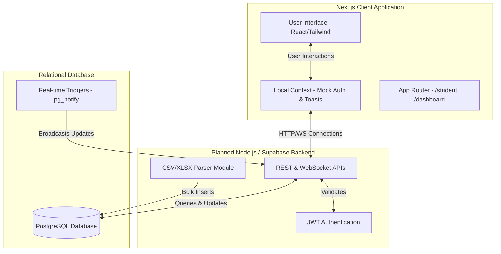

# VeritasGrades: Examination Grading and Query System

A centralized, secure portal for faculty and administrators to manage student records, process examination scores, and query academic data at Veritas University, Bwari. This project serves as a Final Year Project for the Design and Implementation of a Database Scheme and Query System for Students Examination Grading and Processing.

## Project Overview

VeritasGrades digitizes the entire examination lifecycle, moving away from manual, error-prone paper processing. It offers robust role-based access, a beautifully designed monochromatic interface, and secure data handling mechanisms.

## Core Features Implemented

1. **Landing Page and Global Navigation**
   - A premium, responsive black-and-white theme using TailwindCSS.
   - Smooth anchor scrolling to key sections: Features, Workflow, Schema Details, and Security Architecture.
   - Animated grid texture background for a dynamic aesthetic.
   - A streamlined, focused layout removing unnecessary bloat.

2. **Unified Authentication System**
   - Fully mocked frontend authentication powered by React Context API and LocalStorage.
   - Secure login mechanisms with built-in role detection.
   - "Sign Up" flow that restricts all new account creations strictly to the "Student" role and features dynamic, custom course selection using an interactive tag-based input.
   - Hardcoded Admin bypass for faculty testing: Email (`Admin@gmail.com`) and Password (`Admin123`).

3. **Role-Based Dashboards**
   - **Faculty Dashboard**: A protected route displaying top-level university metrics (Total Students, Grades Processed) and an interactive mock table of recent grade submissions. Features a fully-wired "Upload Batch Grades" button that accepts CSV/XLSX files.
   - **Student Dashboard**: A protected route generating a custom Academic Snapshot based on the student's dynamic course selection during registration. Displays calculated CGPA and mocked grades.

4. **Database Schema Documentation**
   - A dedicated documentation section detailing the Third Normal Form (3NF) relational structures for Students, Courses, Grades, and Audit Logs.

## Current Work in Progress (WIP)

We are actively polishing the frontend to premium standards before migrating to a fully real-time backend architecture. Current developments include:
- **Custom Toast Notifications**: Replacing standard browser alerts with sleek, animated, non-blocking toast notifications for actions like logging in and uploading grades.
- **Transcript Exporting**: Implementing native PDF export functionality allowing students to download a stylized, print-ready Result Slip directly from their dashboard.
- **Empty States**: Designing beautiful, engaging empty states for dashboards when no courses are registered or no submissions exist.
- **Confirmation Modals**: Adding robust verification dialogs for critical faculty actions like approving grades.

## Future Road Map: Real-Time Backend Transition

The upcoming phases will transition the mocked application to a fully functional full-stack Next.js architecture using Route Handlers. Below are the planned stages and the exact directories/files that will be created or modified:

### 1. Database & Architecture Setup
*Creating the tables and connecting the app to the database.*
- **`db/schema.sql`** *(New)*: PostgreSQL commands to create `users`, `courses`, and `grades` tables.
- **`.env.local`** *(New)*: Secret database URLs and API keys.
- **`src/lib/supabase.ts`** *(New)*: Utility file to initialize the secure connection to the database.

### 2. Authentication Security
*Replacing mock-login with real, encrypted sessions.*
- **`src/app/api/auth/register/route.ts`** *(New)*: Endpoint that hashes the password using `bcrypt` and saves the user.
- **`src/app/api/auth/login/route.ts`** *(New)*: Endpoint that verifies the password and issues a secure, HTTP-only JWT cookie.
- **`src/context/AuthContext.tsx`** *(Modified)*: Rewrite to verify the user's session with the backend instead of LocalStorage.

### 3. Building Core APIs
*The pipelines for requesting and updating grades securely.*
- **`src/app/api/student/grades/route.ts`** *(New)*: Queries the database for the logged-in student's grades.
- **`src/app/api/faculty/submissions/route.ts`** *(New)*: Fetches all student grades for the Admin table.
- **`src/app/api/faculty/grades/approve/route.ts`** *(New)*: Protected `POST` endpoint to bulk-approve grades.

### 4. CSV Upload Engine
*Parsing files and inserting hundreds of rows at once.*
- **`src/lib/csvParser.ts`** *(New)*: Utility that reads raw CSV files, calculates the curve based on raw scores, and formats the data.
- **`src/app/api/faculty/upload/route.ts`** *(New)*: Endpoint that receives the `.csv`, parses it, and runs a "Bulk Insert" command.
- **`src/app/dashboard/page.tsx`** *(Modified)*: Update `handleFileUpload` to send the file to the new API using `FormData`.

### 5. Real-Time Synchronization
*WebSockets for instant updates without refreshing.*
- **`src/app/dashboard/page.tsx`** *(Modified)*: Adds a hook to subscribe to database changes so dispute reports appear instantly.
- **`src/app/student/page.tsx`** *(Modified)*: Adds a hook to instantly change a `PENDING` badge to a real grade the moment an Admin clicks "Approve".

## System Architecture

The following diagram illustrates the current frontend architecture and the planned real-time backend integration.



## Detailed Project Structure

The project is organized using the Next.js 15+ App Router paradigm. Below is the detailed directory structure:

```text
exam-grading-system/
├── src/
│   ├── app/                      # Next.js App Router (Pages & Layouts)
│   │   ├── dashboard/            # Faculty/Admin Portal
│   │   │   └── page.tsx          # Admin data grid, bulk actions, and modals
│   │   ├── student/              # Student Portal
│   │   │   └── page.tsx          # Transcripts, analytics, and dispute system
│   │   ├── login/                # Authentication routing
│   │   ├── signup/               # Registration routing
│   │   ├── globals.css           # Global Tailwind utilities and Print styles
│   │   ├── layout.tsx            # Root HTML layout and Context Providers
│   │   └── page.tsx              # Landing page
│   ├── components/               # Reusable UI Elements
│   │   ├── Header.tsx            # Global navigation bar
│   │   ├── BackButton.tsx        # Utility navigation
│   │   └── LogoutButton.tsx      # Authentication utility
│   └── context/                  # React Context for State Management
│       ├── AuthContext.tsx       # Manages mock user sessions and roles
│       └── ToastContext.tsx      # Custom non-blocking notification system
├── public/                       # Static assets (images, icons)
├── package.json                  # Dependencies and scripts
├── tailwind.config.ts            # TailwindCSS configuration
└── README.md                     # Project documentation
```

## Getting Started

First, install the necessary dependencies:

```bash
npm install
```

Then, run the development server:

```bash
npm run dev
```

Open http://localhost:3000 with your browser to see the result.

**To test the Faculty Dashboard**, log in using:
Email: `Admin@gmail.com`
Password: `Admin123`

**To test the Student Dashboard**, click "Create Account" on the home page and register a test user.
